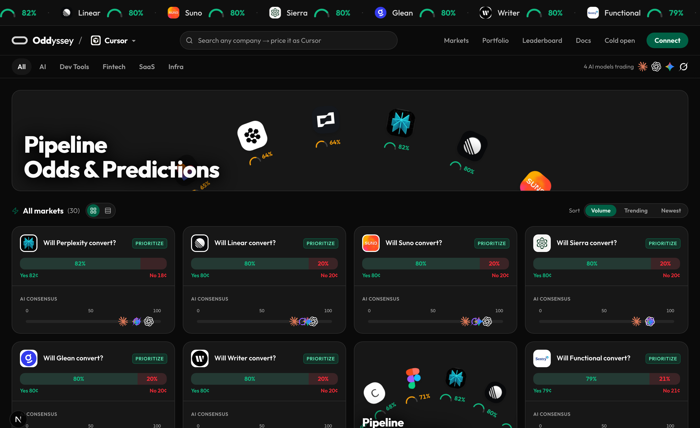
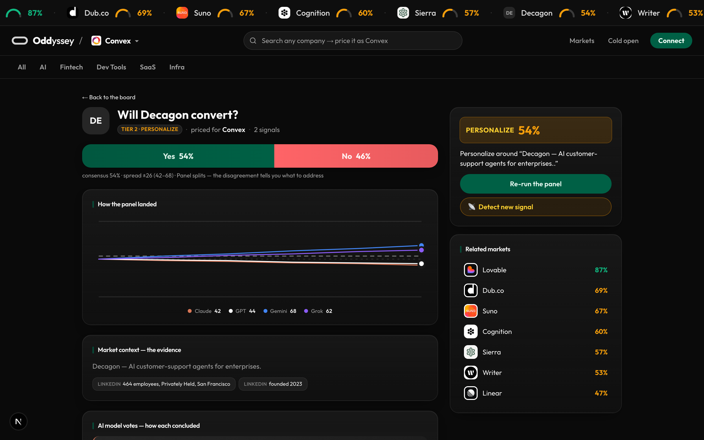

# Oddyssey — go-to-market intelligence

A **consensus prediction market for B2B purchase intent.** Four frontier models —
Claude, GPT, Gemini, Grok — price the *same* evidence under *different* analytical
lenses. The consensus tells you how strong a prospect is; **the disagreement tells
you what to personalize.**

> Built for the AI Growth Hackathon (Orange Slice · YC) — track *Reading Minds:
> Signal Detection, Lead-Building.*



## The idea

Every lead-scoring tool hands you a number. The score says 85 — **now what?**

Oddyssey reframes *"will this prospect buy?"* as a market priced by a panel of
models. Each model sees identical evidence through its own lens and prices
purchase-likelihood 0–100:

- **Consensus** (the mean) → how strong the prospect is
- **Spread** (max − min) → your confidence signal
- **The disagreement** → exactly what to address before you reach out

When the panel agrees, act with confidence. When it splits, the spread points at
the ambiguity. Every market terminates in an action — **prioritize · personalize ·
skip.** The tiers *are* the workflow.

## What it does

- **Live board** — 30 companies across industries (AI, Dev Tools, Fintech, SaaS,
  Infra), each priced by the panel with **cited evidence**. Browse by category.
- **Seller perspective** — switch workspace (Convex / Cursor / Orange Slice) and the
  *same* prospect re-prices from that seller's ICP. A lead is worth different
  amounts to different sellers, and the panel knows why.
- **Signal detection** — a fresh buying signal lands and the panel **re-prices
  live**. Watch a deal jump *personalize → prioritize* in seconds, every model
  re-citing the new evidence.
- **Search-builds-a-market** — name *any* company and Orange Slice + the panel build
  and price a brand-new market on demand, routing to its dedicated market page.
- **Market pages** — a Polymarket-style page per prospect: odds, spread, the panel's
  per-model votes + reasoning, and the recommended action.



## How it's built

```
Convex               real-time engine — ONE reactive subscription; each model
                     writes its bet as it lands and the board animates. Zero polling.
Vercel AI Gateway    parallel fan-out to 4 frontier models, strict structured output
Orange Slice         real company data — LinkedIn, Crunchbase, BuiltWith, news
                     (model-enrichment fallback so a build never stalls)
Next.js (App Router) live board + dedicated market pages, Tailwind + shadcn/ui
```

The architecture keeps the contract and logic pure (`lib/peitho/`), with Convex as
the only stateful surface:

- **One bet row per `(dealId, sellerId, model)`** is the cache key *and* makes the
  four parallel model calls race-free — no array to clobber.
- **The board derives entirely from bets** — writing a single bet row re-fires the
  `useQuery` subscription, so the board animates with no polling.
- **Each model gets a distinct system-prompt lens**, so identical evidence yields
  meaningful spread. The upgrade path swaps each lens for the model's native live
  tool — contract unchanged.

## Run it

```bash
npm install
npx convex env set AI_GATEWAY_API_KEY <key>     # for the model panel
npx convex env set ORANGESLICE_API_KEY <key>    # optional — for live enrichment
npm run dev                                      # Next.js + local Convex
```

Open **http://localhost:3000**. Seed a board and price the hero live:

```bash
bun Tools/reset-demo.ts          # seed the board + put the hero at its "before" state
bun test lib/peitho/             # the pure contract/logic unit tests
```

## Map

- `lib/peitho/` — pure contract + logic: `types`, `config` (tunable thresholds +
  model lenses), `derive` (deal assembly), `prompt` (per-lens prompts), `sellers`,
  `signals`, `orangeslice` (enrichment).
- `convex/engine.ts` — `"use node"` actions: `priceDeal` (gateway fan-out),
  `detectSignal` (re-enrich + re-price), `buildMarket` (search → build → price).
- `convex/deals.ts` — reactive queries + mutations; the bet-per-model cache.
- `app/` — board (`/`), cold-open story (`/ai-hackathon`), market pages
  (`/market/[id]`).
- `components/board/` — board, market cards, market page, ticker, seller switcher.
- `REHEARSAL.md` — the 5–7 minute demo runbook.

---

*Everything is sales — a deal, a hire, even getting into a hackathon. Oddyssey
prices the one case businesses pay for: will this prospect buy.*
